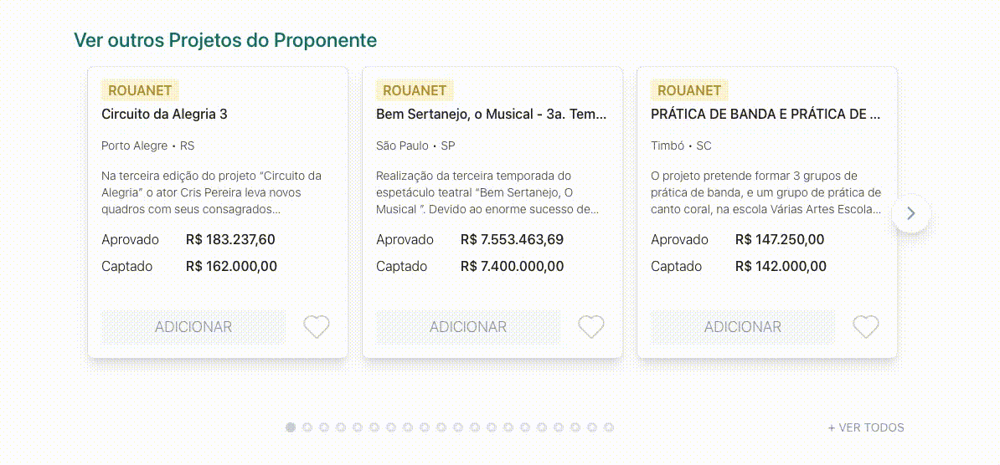
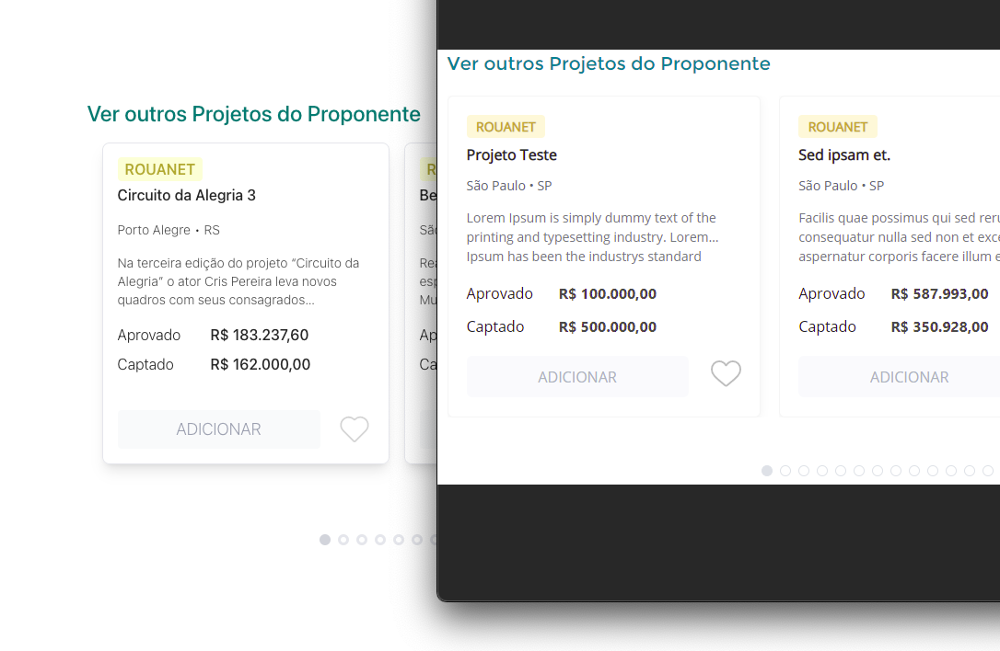

# **[Simbi](https://simbi.social) - Take Home Assignment**




## **Installation**
To install the project, follow these steps:

```
git clone https://github.com/caiankeller/simbi_take_home_assignment.git
```
```
cd simbi_take_home_assignment
```
```
composer install && npm i
```

> Note: The database is expected to be loaded.

> The backend will look for the 'projects' table in the 'simbi' database. A little change since I decided to create a migrate for the table.

### **Usage**
To run the project, use the command:

```
npm run vite
```

> The command will start the server on http://localhost:8000/ and launch both Vite, React and Laravel at the same time.

> The **React** files are located [here](./resources/js).

To run only the **Laravel** use the following command:

```
php artisan serve
```

To generate new Swagger YAML, use:

```
npm run swagger
```

### **API Documentation**
The API documentation is available in the [yaml](./swagger.yaml) file.
